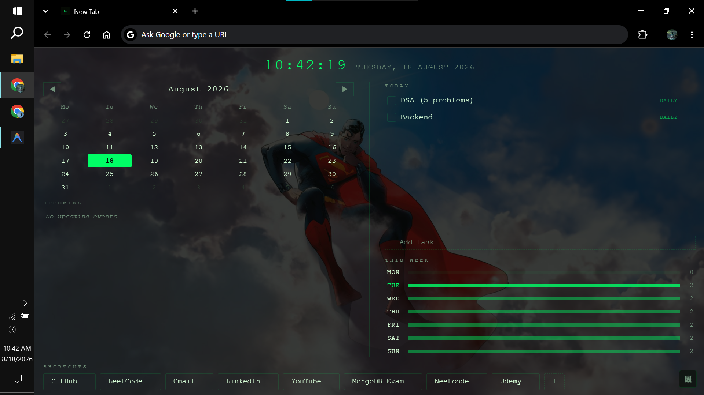

# 🟢 Matrix New Tab: Calendar & Task Manager

A lightweight, minimalist, and ultra-fast Chrome Extension that turns your New Tab page into a personal daily dashboard inspired by the iconic Matrix aesthetic. 

Designed to fit perfectly within a single viewport without vertical scrolling, keeping all your critical daily info at a glance.




---

## ✨ Features

- 🕒 **Live Digital Clock & Date**: Clean monospace header displaying real-time clock and full date.
- 📅 **Interactive Calendar & Upcoming Events**:
  - Full month view with month navigation.
  - Dot indicators on days with events.
  - Dedicated "Upcoming Events & Deadlines" list.
- 📝 **Task Management**:
  - Add, edit, check off, and delete daily tasks.
  - Support for **recurring tasks** (*Daily*, *Weekdays (Mon–Fri)*, *Weekly*).
- 📊 **Weekly Overview**: Visual bar charts showing daily task density across the current week. Click any day to view its specific tasks in a modal.
- 🔗 **Quick Shortcuts**: Customizable bookmark links at the bottom with quick add & inline edit options.
- 🖼 **Custom Background Image**:
  - Small control button fixed to the bottom-right corner.
  - Upload custom background wallpapers (auto-compressed locally for instant loading & memory efficiency).
  - Adjust opacity (0–100%) and select CSS blend modes (*Normal, Multiply, Screen, Overlay, Soft Light, Hard Light, Luminosity, Color*).
- ⚡ **Lightweight & Private**: Built with zero external frameworks or libraries. All data is persisted strictly in your browser (`chrome.storage.local` / `localStorage`).

---

## 🚀 Installation & Setup

1. **Clone or Download** this repository:
   ```bash
   git clone https://github.com/your-username/chrome-matrix-dashboard.git
   ```
2. Open Chrome and navigate to `chrome://extensions/`.
3. Enable **Developer mode** using the toggle switch in the top right corner.
4. Click **Load unpacked**.
5. Select the project folder containing `manifest.json`.
6. Open a new tab to see your new dashboard!

---

## 🛠 Project Structure

```text
├── manifest.json   # Chrome Extension Manifest V3 configuration
├── newtab.html     # Main HTML structure
├── style.css       # Matrix theme styling & responsive adjustments
├── app.js          # Core logic (Calendar, Tasks, Storage & BG controls)
├── image.png       # Dashboard screenshot preview
└── icons/          # Extension icons (16px, 48px, 128px)
```

---

## 🎨 Design Theme

- **Font**: Monospace (`Courier New` fallback to `Consolas`)
- **Primary Color**: `#D8FFD8`
- **Accent Color**: `#00FF66`
- **Background**: Deep Matrix Dark `#050805`

---

## 📄 License

This project is open-source and available under the [MIT License](LICENSE).
